# INSTALLING THE NGINX WEB SERVER

To display web pages to our site visitors, we are going to employ Nginx, a high-performance web server, using the apt package manager to install this package

we would first update our server’s package index by running the below

sudo apt update
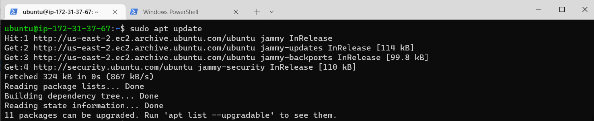

Next step to get nginx installed we run -

sudo apt install nginx

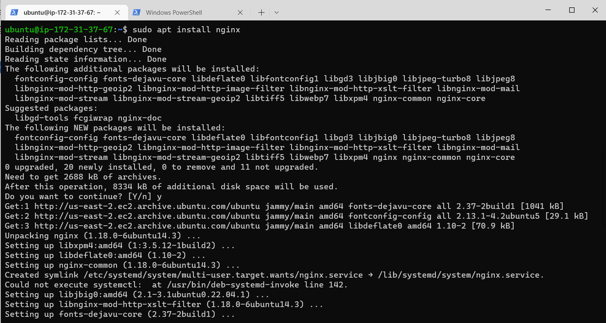

To verify that nginx was successfully installed and is running as a service in Ubuntu, run:

sudo systemctl status nginx

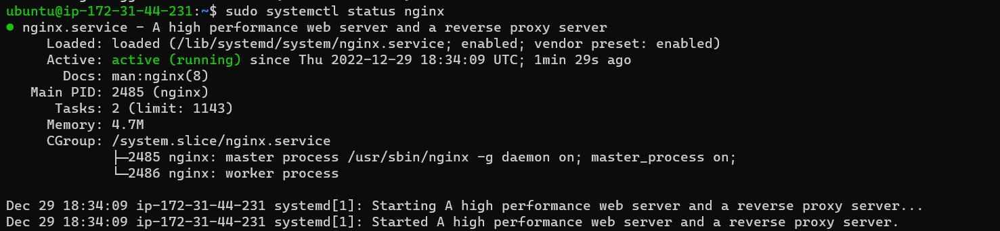

To check how we can access it locally in our Ubuntu shell, run:

curl http://127.0.0.1:80

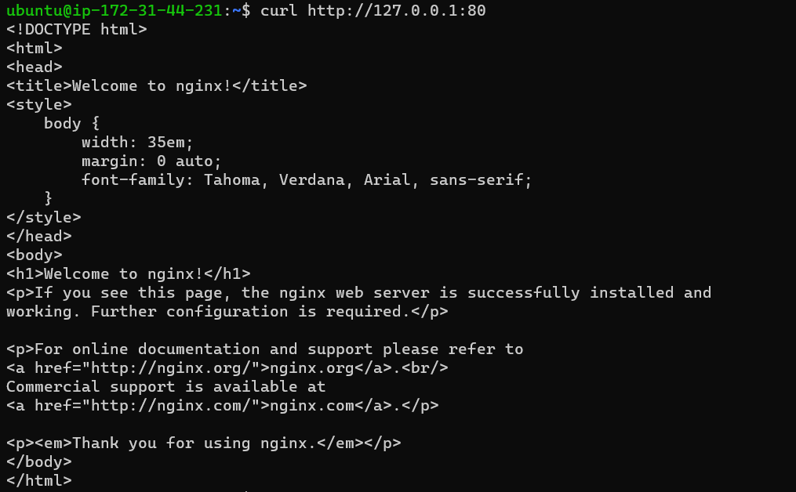

# Istalling mysql

Now that you have a web server up and running, you need to install a Database Management System (DBMS) to be able to store and manage data for your site in a relational database. MySQL is a popular relational database management system used within PHP environments

To install this software, we will first run this command -

sudo apt install mysql-server

When prompted, confirm installation by typing Y, and then ENTER.

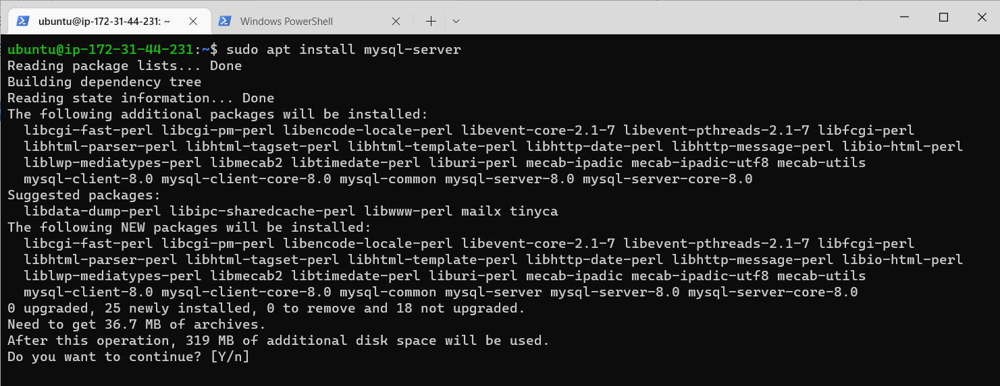

When the installation is finished, log in to the MySQL console by typing:

$ sudo mysql

This will connect to the MySQL server as the administrative database user root, which is inferred by the use of sudo when running this command. You should see output like this:

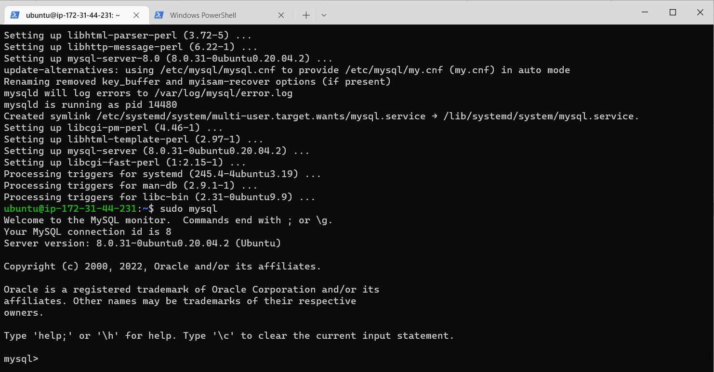

Exit the MySQL shell with:

mysql> exit

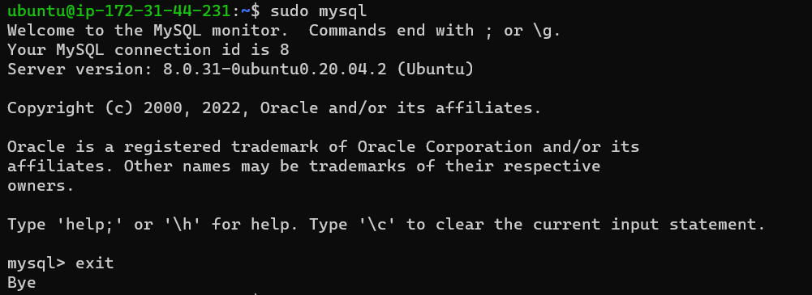

Then Start the interactive script by running:

sudo mysql_secure_installation

This will ask if you want to configure the VALIDATE PASSWORD PLUGIN.

Note: Enabling this feature is something of a judgment call. If enabled, passwords which don’t match the specified criteria will be rejected by MySQL with an error. It is safe to leave validation disabled, but you should always use strong, unique passwords for database credentials.

Answer Y for yes, or anything else to continue without enabling.

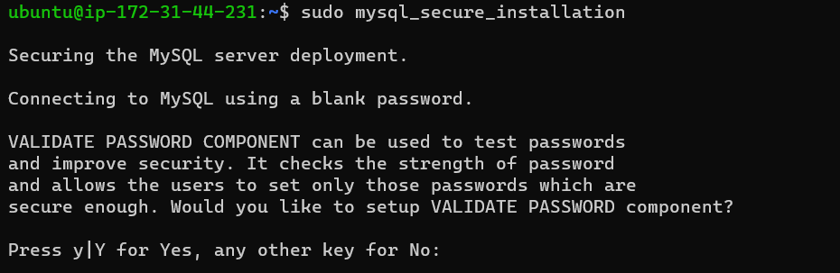

For the rest of the questions, press Y and hit the ENTER key at each prompt. This will prompt you to change the root password, remove some anonymous users and the test database, disable remote root logins, and load these new rules so that MySQL immediately respects the changes you have made.

When you’re finished, test if you’re able to log in to the MySQL console by typing:

$ sudo mysql -p

Notice the -p flag in this command, which will prompt you for the password used after changing the root user password.

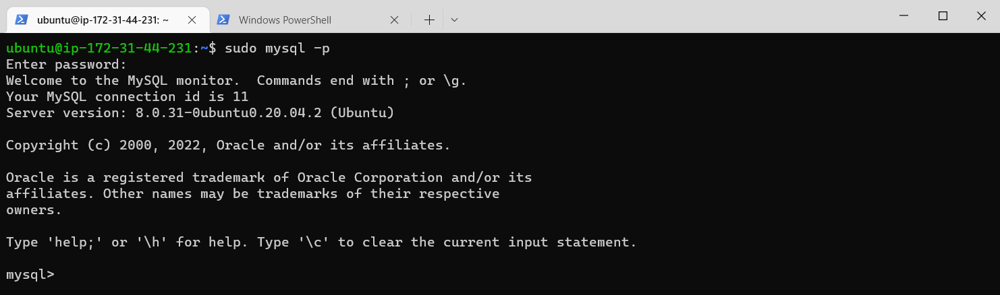

To exit the MySQL console, type:

mysql> exit

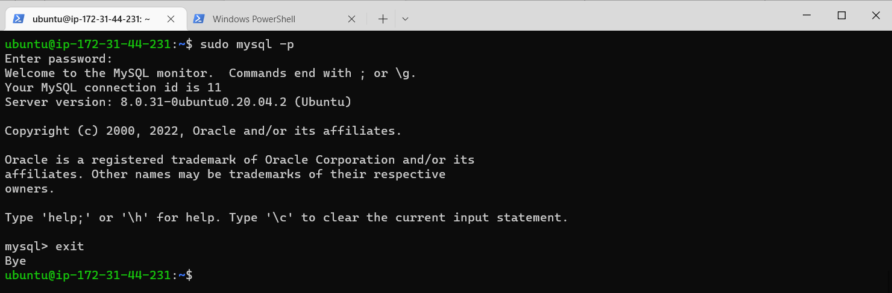

Your MySQL server is now installed and secured

# Installing php

You have Nginx installed to serve your content and MySQL installed to store and manage your data. Now you can install PHP to process code and generate dynamic content for the web server

You’ll need to install php-fpm, which stands for “PHP fastCGI process manager”, and tell Nginx to pass PHP requests to this software for processing. Additionally, you’ll need php-mysql, a PHP module that allows PHP to communicate with MySQL-based databases. Core PHP packages will automatically be installed as dependencies.

To install these 2 packages at once, run:

sudo apt install php-fpm php-mysql

When prompted, type Y and press ENTER to confirm installation

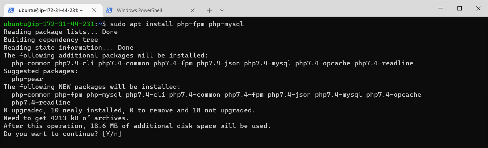

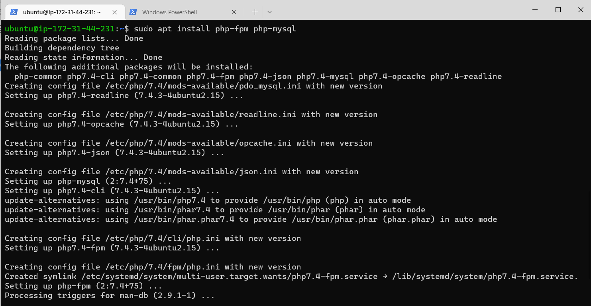

You now have your PHP components installed

# Configuring nginx to use php processor

When using the Nginx web server, we can create server blocks (similar to virtual hosts in Apache) to encapsulate configuration details and host more than one domain on a single server

Create the root web directory for your_domain by running this command-

sudo mkdir /var/www/projectLEMP

Next, assign ownership of the directory with the $USER environment variable, which will reference your current system user:

sudo chown -R $USER:$USER /var/www/projectLEMP

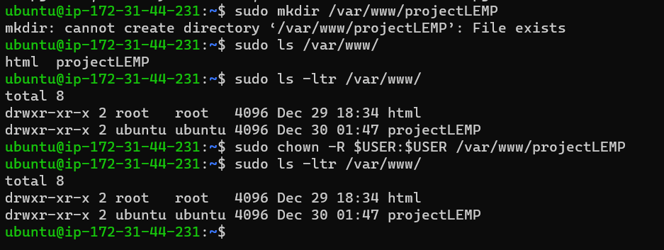

This will create a new blank file. Paste in the following bare-bones configuration:

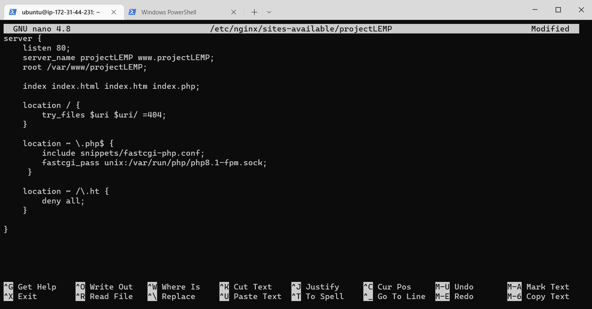

When you’re done editing, save and close the file by typing CTRL+X and then y and ENTER to confirm.

Activate your configuration by linking to the config file from Nginx’s sites-enabled directory: run-

sudo ln -s /etc/nginx/sites-available/projectLEMP /etc/nginx/sites-enabled/

This will tell Nginx to use the configuration next time it is reloaded. You can test your configuration for syntax errors by typing:

sudo nginx -t
You shall see following message:

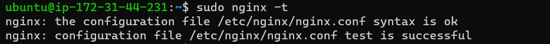

We also need to disable default Nginx host that is currently configured to listen on port 80, for this run:

sudo unlink /etc/nginx/sites-enabled/default

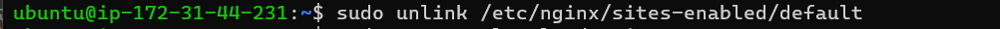

When you are ready, reload Nginx to apply the changes:

sudo systemctl reload nginx

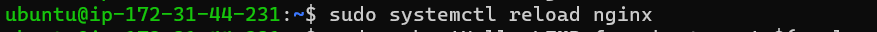

Your new website is now active, but the web root /var/www/projectLEMP is still empty. Create an index.html file in that location so that we can test that your new server block works as expected

Now go to your browser and try to open your website URL using IP address:

http://<Public-IP-Address>:80

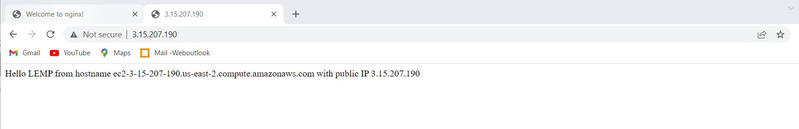

Your LEMP stack is now fully configured. In the next step, we’ll create a PHP script to test that Nginx is in fact able to handle .php files within your newly configured website

# Testing PHP with Nginx

Your LEMP stack should now be completely set up.

At this point, your LAMP stack is completely installed and fully operational.

You can test it to validate that Nginx can correctly hand .php files off to your PHP processor.

You can do this by creating a test PHP file in your document root. Open a new file called info.php within your document root in your text editor:

sudo nano /var/www/projectLEMP/info.php

Type or paste the following lines into the new file. This is valid PHP code that will return information about your server:

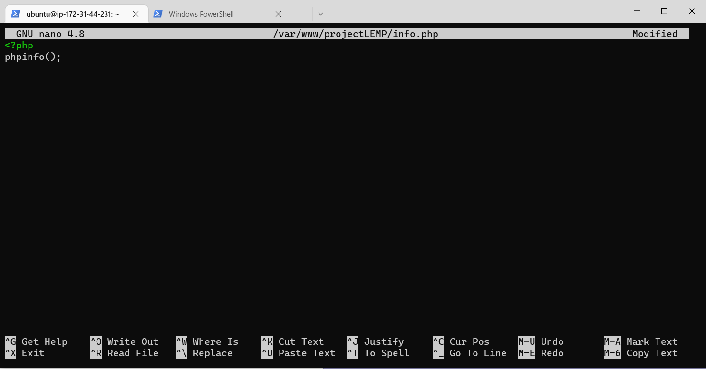

You can now access this page in your web browser by visiting the domain name or public IP address you’ve set up in your Nginx configuration file, followed by /info.php:

http://`server_domain_or_IP`/info.php

You will see a web page containing detailed information about your server:

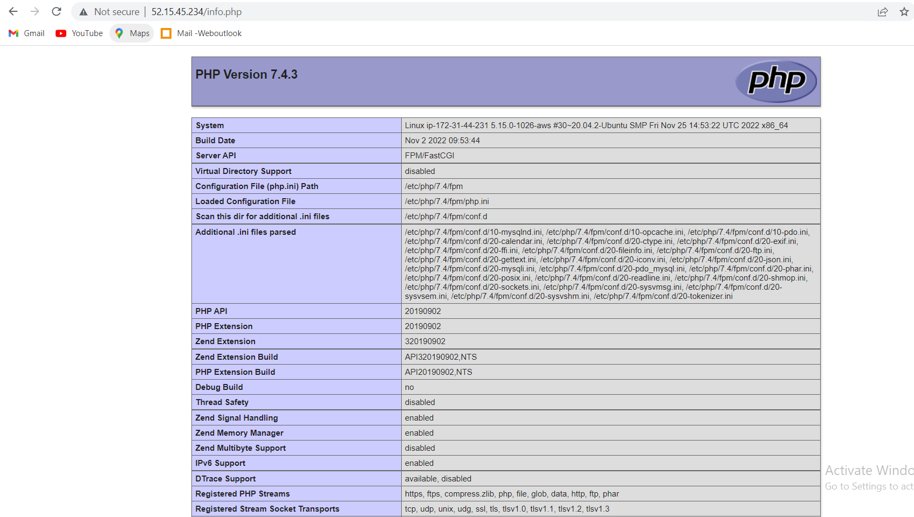

After checking the relevant information about your PHP server through that page, it’s best to remove the file you created as it contains sensitive information about your PHP environment and your Ubuntu server. You can use rm to remove that file:

sudo rm /var/www/your_domain/info.php 

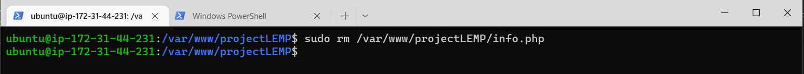

You can always regenerate this file if you need it later.

# Retrieving data from MySQL database with PHP

In this step you will create a test database (DB) with simple "To do list" and configure access to it, so the Nginx website would be able to query data from the DB and display it.

First, connect to the MySQL console using the root account:

sudo mysql

To create a new database, run the following command from your MySQL console:

mysql> CREATE DATABASE `example_database`;

To create a new database, run the following command from your MySQL console:

mysql> CREATE DATABASE `example_database`;
Now you can create a new user and grant him full privileges on the database you have just created.

The following command creates a new user named example_user, using mysql_native_password as default authentication method. We’re defining this user’s password as password, but you should replace this value with a secure password of your own choosing.

mysql>  CREATE USER 'example_user'@'%' IDENTIFIED WITH mysql_native_password BY 'password';
Now we need to give this user permission over the example_database database:

mysql> GRANT ALL ON example_database.* TO 'example_user'@'%';

This will give the example_user user full privileges over the example_database database, while preventing this user from creating or modifying other databases on your server.

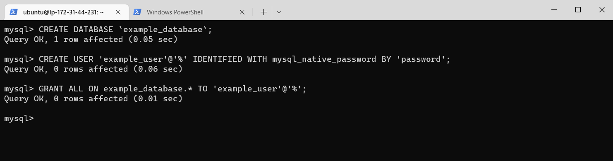

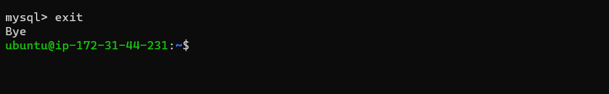

mysql> SHOW DATABASES;

This will give you the following output:

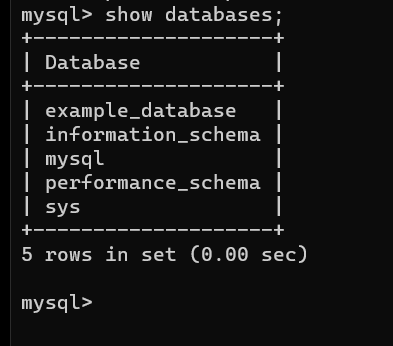

You can test if the new user has the proper permissions by logging in to the MySQL console again, this time using the custom user credentials:

mysql -u example_user -p

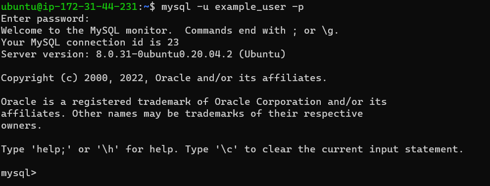

Next, we’ll create a test table named todo_list. From the MySQL console, run the following statement:

CREATE TABLE example_database.todo_list (
mysql>     item_id INT AUTO_INCREMENT,
mysql>     content VARCHAR(255),
mysql>     PRIMARY KEY(item_id)
mysql> );
Insert a few rows of content in the test table. You might want to repeat the next command a few times, using different VALUES:

mysql> INSERT INTO example_database.todo_list (content) VALUES ("My first important item");
To confirm that the data was successfully saved to your table, run:

mysql>  SELECT * FROM example_database.todo_list;

You’ll see the following output:

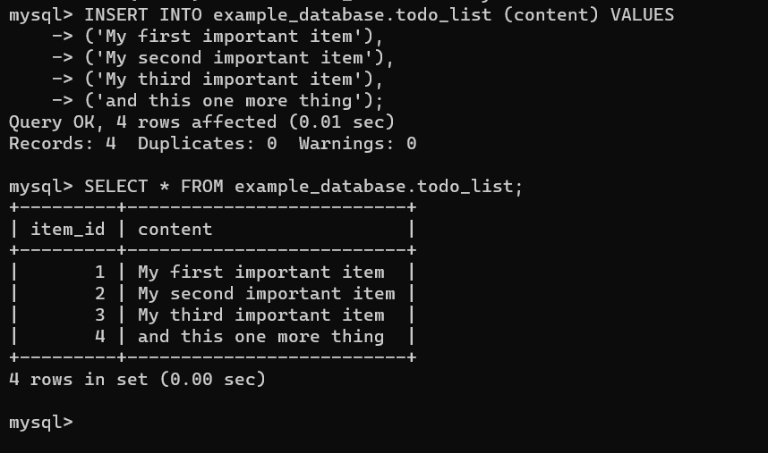

After confirming that you have valid data in your test table, you can exit the MySQL console:

mysql> exit

Now you can create a PHP script that will connect to MySQL and query for your content. Create a new PHP file in your custom web root directory using your preferred editor. We’ll use vi for that:

nano /var/www/projectLEMP/todo_list.php

The following PHP script connects to the MySQL database and queries for the content of the todo_list table, displays the results in a list. If there is a problem with the database connection, it will throw an exception.

Copy this content into your todo_list.php script:

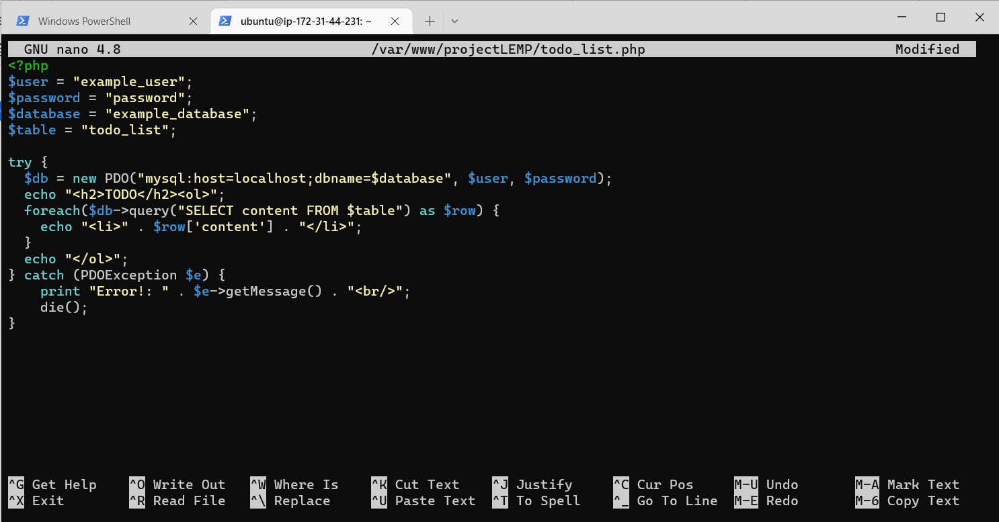

Save and close the file when you are done editing

You can now access this page in your web browser by visiting the domain name or public IP address configured for your website, followed by /todo_list.php:

http://<Public_domain_or_IP>/todo_list.php

You should see a page like this, showing the content you’ve inserted in your test table:

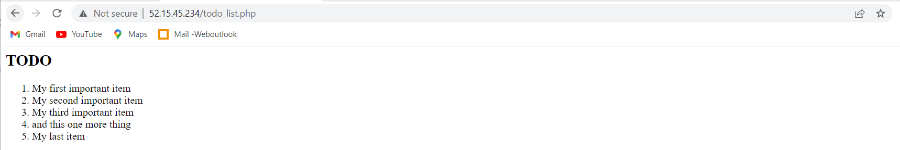

That means your PHP environment is ready to connect and interact with your MySQL server

